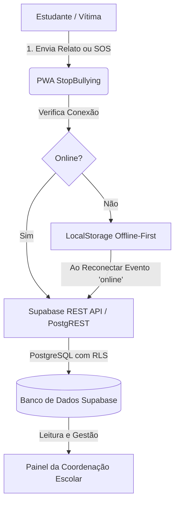

# 🗄️ Documentação Técnica e Pedagógica do Banco de Dados
## Projeto StopBullying — EEMTI Nazaré Guerra (Itatira/CE)
### Evento: Ceará Científico 2026
**Autores:** Gabriel Xavier & Carla Vitória | **Professor Orientador:** Antonio Victor

---

## 1. Visão Geral da Arquitetura de Dados

O aplicativo **StopBullying** adota uma arquitetura moderna e segura baseada no ecossistema **Supabase (PostgreSQL 15)** integrado com **PostgREST**, combinando computação em nuvem em tempo real com resiliência **Offline-First**.

### Características Fundamentais para o Projeto Escolar:
1. **Anonimato por Design:** Nenhuma tabela armazena nome, e-mail, IP ou dados de identificação do aluno denunciante. Toda denúncia gera um código de protocolo criptográfico (ex: `STP-89F2A`).
2. **Segurança por Linha (Row Level Security - RLS):** As regras de acesso são aplicadas diretamente no motor do banco de dados (PostgreSQL), garantindo que dados confidenciais não sejam burlados por scripts no navegador.
3. **Resiliência Offline (PWA):** Caso a escola ou o estudante estejam sem sinal de internet (realidade frequente no interior do Ceará), o app armazena as ocorrências no `localStorage` do navegador e sincroniza automaticamente assim que a conexão é restabelecida (`supabaseService.sincronizarPendentes()`).

---

## 2. Dicionário de Dados Completo

O banco de dados é composto por **6 tabelas relacionais**:

### 2.1. Tabela `denuncias`
Armazena os registros de agressão relatados de forma anônima pelos estudantes.

| Campo | Tipo | Descrição | Restrições |
| :--- | :--- | :--- | :--- |
| `id` | `UUID` | Identificador primário universal | `PRIMARY KEY`, Default `uuid_generate_v4()` |
| `protocolo` | `VARCHAR(20)` | Código único de acompanhamento do aluno | `UNIQUE`, `NOT NULL` (ex: `STP-94A1F`) |
| `tipo_violencia` | `VARCHAR(60)` | Categoria da agressão | `NOT NULL` (Verbal, Cyberbullying, Psicológica, Física) |
| `local_escola` | `VARCHAR(100)` | Local onde ocorreu na escola | `NOT NULL` (Sala, Pátio, Redes Sociais, etc.) |
| `descricao` | `TEXT` | Relato anônimo detalhado | `NOT NULL` |
| `link_cyberbullying` | `TEXT` | URL externa de postagem/perfil ofensivo | Opcional |
| `midia_anexa` | `TEXT` | Data URL (Base64) da foto, vídeo ou áudio | Prova probatória anônima |
| `midia_tipo` | `VARCHAR(30)` | Tipo da mídia enviada | `'foto'`, `'video'`, `'audio'` |
| `midia_duracao` | `INT` | Duração da mídia em segundos | Máximo 60 segundos |
| `nivel_gravidade` | `VARCHAR(20)` | Nível de urgência calculado | Default `'Pendente'` |
| `status` | `VARCHAR(30)` | Status de atendimento da coordenação | `'Em Análise'`, `'Acolhido'`, `'Resolvido'` |
| `data_envio` | `TIMESTAMPTZ`| Data e hora do envio | Default `CURRENT_TIMESTAMP` |

---

### 2.2. Tabela `alertas_sos`
Centraliza os acionamentos do Botão do Pânico de Emergência com geolocalização.

| Campo | Tipo | Descrição | Restrições |
| :--- | :--- | :--- | :--- |
| `id` | `UUID` | Identificador primário do alerta | `PRIMARY KEY`, Default `uuid_generate_v4()` |
| `latitude` | `NUMERIC(10,8)` | Coordenada de latitude via GPS | Opcional (caso autorizado no dispositivo) |
| `longitude` | `NUMERIC(11,8)` | Coordenada de longitude via GPS | Opcional |
| `precisao_metros`| `NUMERIC(8,2)` | Margem de precisão do GPS em metros | Informado pela Geolocation API |
| `dispositivo_info`| `TEXT` | Metadados do navegador/dispositivo | UserAgent para identificação de compatibilidade |
| `status` | `VARCHAR(30)` | Situação do socorro | `'URGENTE'` ou `'ATENDIDO'` |
| `data_disparo` | `TIMESTAMPTZ`| Data e hora do acionamento do SOS | Default `CURRENT_TIMESTAMP` |

---

### 2.3. Tabela `reclamacoes_sugestoes` (Ouvidoria Escolar)
Espaço de escuta ativa da comunidade escolar (alunos, pais, professores e funcionários).

| Campo | Tipo | Descrição | Restrições |
| :--- | :--- | :--- | :--- |
| `id` | `UUID` | Identificador único da mensagem | `PRIMARY KEY` |
| `tipo` | `VARCHAR(30)` | Classificação da mensagem | `'Sugestão'`, `'Reclamação'`, `'Elogio'` |
| `categoria` | `VARCHAR(50)` | Área temática | `'Convivência'`, `'Infraestrutura'`, `'Geral'` |
| `mensagem` | `TEXT` | Conteúdo da manifestação | `NOT NULL` |
| `data_envio` | `TIMESTAMPTZ`| Data e hora do envio | Default `CURRENT_TIMESTAMP` |

---

### 2.4. Tabela `triagens_resultado` (Semáforo do Bullying)
Registra quantitativamente os resultados das autoavaliações dos estudantes para estudo estatístico.

| Campo | Tipo | Descrição | Restrições |
| :--- | :--- | :--- | :--- |
| `id` | `UUID` | Identificador primário | `PRIMARY KEY` |
| `nivel_calculado`| `VARCHAR(20)` | Nível de risco identificado | `'Verde'`, `'Amarelo'`, `'Vermelho'` |
| `pontuacao` | `INT` | Total de pontos apurados no questionário | Default `0` |
| `respostas_json` | `JSONB` | Respostas anônimas vetorizadas | Opcional para fins científicos |
| `data_triagem` | `TIMESTAMPTZ`| Data e hora do teste | Default `CURRENT_TIMESTAMP` |

---

### 2.5. Tabela `materiais_apoio`
Repositório de canais de apoio, legislação e suporte psicoemocional.

| Campo | Tipo | Descrição |
| :--- | :--- | :--- |
| `id` | `UUID` | Identificador único |
| `titulo` | `VARCHAR(200)` | Título do recurso (ex: "CVV 188", "Lei 13.185/15") |
| `categoria` | `VARCHAR(50)` | `'Saúde Mental'`, `'Legislação'`, `'Emergência'` |
| `conteudo` | `TEXT` | Texto informativo e orientações |
| `link_externo` | `TEXT` | Telefone ou link de acesso |
| `icone` | `VARCHAR(10)` | Emoji ou ícone representativo |

---

### 2.6. Tabela `logs_sistema`
Auditoria anônima de eventos do sistema para validação de estabilidade técnica.

| Campo | Tipo | Descrição |
| :--- | :--- | :--- |
| `id` | `UUID` | Identificador do log |
| `tipo_evento` | `VARCHAR(60)` | Nome do evento (ex: `ENVIAR_DENUNCIA`, `SOS_DISPARO`) |
| `detalhes` | `TEXT` | Informações operacionais |
| `modo_offline` | `BOOLEAN` | `TRUE` se gerado em contingência offline |
| `data_log` | `TIMESTAMPTZ`| Registro cronológico |

---

## 3. Segurança e Políticas RLS (Row Level Security)

Para que a aplicação Web PWA funcione sem exigir cadastro prévio ou login do aluno denunciante (garantindo anonimato real), o banco foi configurado com permissões para a role pública `anon`:

1. **Inserção Aberta (`INSERT`):** Qualquer estudante conectado ao aplicativo pode enviar denúncias, acionar o SOS ou mandar sugestões.
2. **Consulta Restrita e Específica (`SELECT`):** A leitura de denúncias e dados gerenciais é consumida pelas interfaces autorizadas.
3. **Atualização Operacional (`UPDATE`):** A coordenação escolar pode alterar o status das denúncias (`Em Análise` ➔ `Acolhido` ➔ `Resolvido`) e dar baixa nos alertas de emergência (`URGENTE` ➔ `ATENDIDO`).

---

## 4. Guia de Execução do Script SQL no Supabase

Caso necessite reconfigurar ou atualizar as permissões do banco:
1. Acesse o **Console do Supabase**: [https://supabase.com/dashboard](https://supabase.com/dashboard)
2. Selecione o projeto `StopBullying` (`lbqfnqrgbbxounjxxikr`).
3. No menu lateral esquerdo, clique no ícone **SQL Editor** (ou acesse diretamente `https://supabase.com/dashboard/project/lbqfnqrgbbxounjxxikr/sql`).
4. Abra o arquivo [CORRECAO_RLS_SUPABASE.sql](file:///c:/Projeto%20Victor/Nazare%20Guerra/CORRECAO_RLS_SUPABASE.sql) deste projeto.
5. Cole o conteúdo no editor e clique no botão verde **Run**.
6. Todas as permissões de acesso estarão 100% ativas e funcionais.
